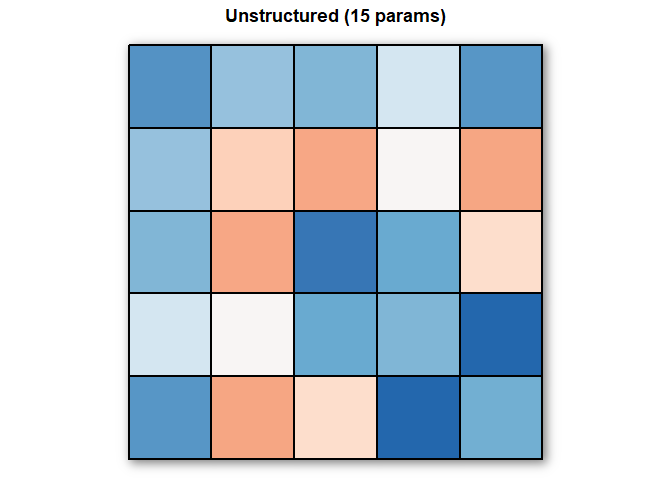

<!-- README.md is generated from README.Rmd. Please edit that file -->

# DoubleHelix

<!-- badges: start -->
<!-- badges: end -->

The goal of `DoubleHelix` is to provide a quick and easy way to create
engaging visual resources, including figures, GIFs, and formulas, based
on the theory of quantitative genetics.

This package aims to make these resources more accessible to instructors
and students, supporting teaching and learning in genetics and
quantitative genetics through intuitive and customizable visualizations.

## Installation

You can install the development version of `DoubleHelix` from
[GitHub](https://github.com/filipe-manoel/DoubleHelix) with:

``` r
# install.packages("pak")
pak::pak("filipe-manoel/DoubleHelix")
```

## Example 1

This is how you can plot and export some common covariance matrices
structures.

``` r
library(DoubleHelix)

#Compound Simetry matrix
plot_cs(n = 5, rho = 0.5, save_path = NULL, width = 5, height = 5, dpi = 300)
```


    #>      [,1] [,2] [,3] [,4] [,5]
    #> [1,]  1.0  0.5  0.5  0.5  0.5
    #> [2,]  0.5  1.0  0.5  0.5  0.5
    #> [3,]  0.5  0.5  1.0  0.5  0.5
    #> [4,]  0.5  0.5  0.5  1.0  0.5
    #> [5,]  0.5  0.5  0.5  0.5  1.0

    #Unstructured matrix
    plot_us(n = 5, save_path = NULL, width = 5, height = 5, dpi = 300)



    #>           [,1]      [,2]      [,3]      [,4]      [,5]
    #> [1,] 0.8876911 0.7643420 0.7955070 0.6542082 0.8784307
    #> [2,] 0.7643420 0.3133744 0.2266019 0.4898930 0.2231422
    #> [3,] 0.7955070 0.2266019 0.9592940 0.8305832 0.3499647
    #> [4,] 0.6542082 0.4898930 0.8305832 0.7976297 0.9973428
    #> [5,] 0.8784307 0.2231422 0.3499647 0.9973428 0.8174562

    #First order factor analytic matrix
    plot_fa(n = 5, k = 1, save_path = NULL, width = 5, height = 5, dpi = 300)


    #>           [,1]      [,2]      [,3]      [,4]      [,5]
    #> [1,] 0.2383609 0.2241361 0.1404669 0.3423505 0.3452570
    #> [2,] 0.2241361 0.6416056 0.1946451 0.4743953 0.4784229
    #> [3,] 0.1404669 0.1946451 0.3727046 0.2973052 0.2998293
    #> [4,] 0.3423505 0.4743953 0.2973052 0.8267596 0.7307537
    #> [5,] 0.3452570 0.4784229 0.2998293 0.7307537 1.0000000

## Example 2

By using `plot_cov_operations`, you can plot figures representing
operations with covariance matrices.

``` r
library(DoubleHelix)

cov1 = plot_diagonal(n=3)
```


``` r
cov2 = plot_ar1(n=5, rho=0.7)
```


``` r
plot_cov_operations(cov1 = cov1, cov2 = cov2, op="kronecker")
```


## Development Status

This package is in active development and currently in an experimental
stage.

Contributions are welcome! Feel free to fork the repository, submit pull
requests, or open issues via
[GitHub](https://github.com/filipe-manoel/DoubleHelix).

## License

This package is released under the [MIT
License](https://opensource.org/licenses/MIT).
